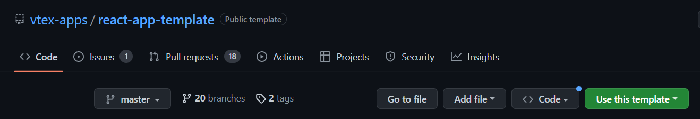

# Custom Quick Order

## Información General:

El presente repositorio contiene el componente custom _Quick Order_. Dicho componente fué implementado con **React** y **Typescript** para **Vtex IO**. Su principal objetivo es permitir agregar un producto mediante un código sku y seguir el flujo hasta el checkout.

## :wrench:Configuraciones

### Paso 1 - Clonar el repositorio:

En primer lugar se debe crear un nuevo repositorio utilizando la estructura del [Template-React](https://github.com/vtex-apps/react-app-template)

Despúes, deberas clonar el repositorio creado, en tu editor de código elegido.

### Paso 2 - Editar el Manifest.json:

Una vez, tengas el repositorio clonado en tu ambiente de trabajo, procedes a configurar el `Manifest.json`. detallando los siguientes puntos:

- vendor
- name
- version
- title
- description

Veamos un ejemplo:

    {
      "vendor": "itgloberspartnercl",
      "name": "quick-order",
      "version": "0.0.1",
      "title": "Compra rápida",
      "description": "Input que permitirá una compra rapida en mi sitio VTEX IO",
    }

Además, configurar la sección de **builders**, agregando la app store, así:

      {
         "builders": {
          "react": "3.x",
          "messages": "1.x",
          "docs": "0.x",
          "store": "0.x"
         }
      }

    Ahora, si la App requiere configuraciones de dependencias, deberas hacerlo de la siguiente manera:

    {
      "dependencies": {
         "vtex.checkout-graphql": "0.x",
         "vtex.search-graphql": "0.x",
         "vtex.css-handles": "0.x"
    }

### Paso 3 - Editar el Package.json:

En esta sección se debe modificar el archivo **`package.json`** así:

{
    "version": "0.0.1",
    "name": "quick-order",
}

Tambien, deberas modificar el archivo **`package.json`** dentro de la carpeta `React`

### Paso 4 - Instalación de dependencias en React:

Ahora, lo que prosigue es, estando dentro del folder `react`, instalar las dependencias, para este proyecto utilizamos `Yarn`

### Paso 5 - Creación de folder Store:

Es importante crear un folder a nivel global llamado `store`, dicho folder va a contener un archivo llamado `interfaces.json`, en ese archivo vamos a encontrar lo siguiente:

    {
        "quick-order": {
            "component": "QuickOrder",
            "render": "client"
        }
    }

Una vez declarada esta información, ahora sí, podremos llamar a nuestro componente desde nuestra app base o **store theme**

### Paso 6 - Creación de componente:

En el folder React, debemos crear un archivo `name-componente.tsx`, esto es, porque trabajaremos con React y Typescript.

### Paso 7 - Puntos a tener en cuenta:

Para recordar: el comando `vtex link` nos permite vincular nuestros archivos locales con la plataforma `vtex`. En ese orden de ideas:

**NOTA**: Es recomendable, iniciar vinculando tu app custom antes que tu tienda base ó store theme.

### Colaboradores:

- Lorraine Gelis Díaz 
